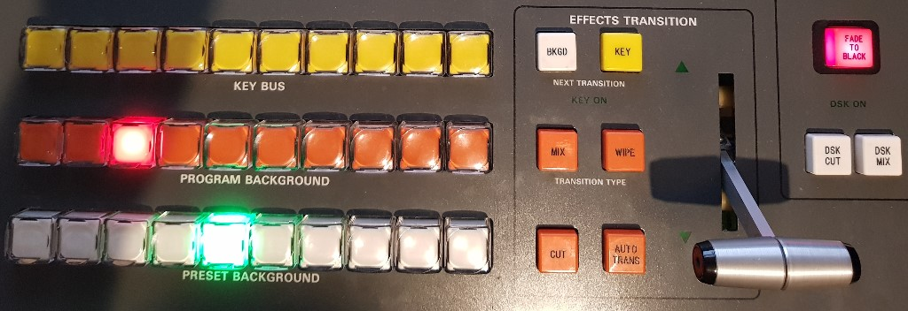

# GVG-ATEM

Use a GVG (GVG100 or GVG110) broadcast panel to control Blackmagic ATEM using Arduino, Firmata and PowerShell.

See <https://ianmorrish.wordpress.com> for more information.
Video demo <https://www.youtube.com/watch?v=WQSQSV-PMF0>

Credit to various posters in this ATEMUser forum for wiring and programming advice
<http://www.atemuser.com/forums/atem-vision-mixers/developers/gvg-100-panel-control-atem-schematics-wanted>

The GVG hardware is modified as per <http://www.lefflerpost.com.au/ATEM/gvg110%2520panel%2520mods.pdf>
(making this solution pin for pin compatible with GVG2ATEM)

The is just a hack, using the Arduino keypad library. Copy this modified keypad.cpp file over the top of the existing one.
I should create a better one that uses pointer based array rather than characters for eack key. Need to learn more about libraries and creating my own.

I should also define some custom sysex commands in Firmata so I don't have to send/receieve commands as string data all the time.

PowerShell code relies on some libraries not included in this project (these libraries have different licenses).

switcherlib.dll uses MIT license.
It should be possible to use alternative Firmata client libraries and ATEM UDP libraries to achieve a completely open-source and cross platform solution (using Node.js or Python for example).

I am also working on some other panel conversions for Sony DFS-7000, Echolab and Ross.
